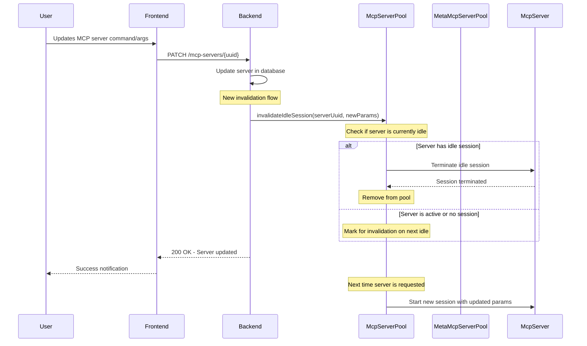

# MCP Server Session Invalidation Flow

## Key Changes

1. **Immediate Invalidation**: When server config changes, immediately invalidate idle sessions
2. **Lazy Loading**: Active sessions continue until idle, then get invalidated
3. **Config Refresh**: New sessions automatically use updated configuration
4. **No Restart Required**: Changes take effect without service restart